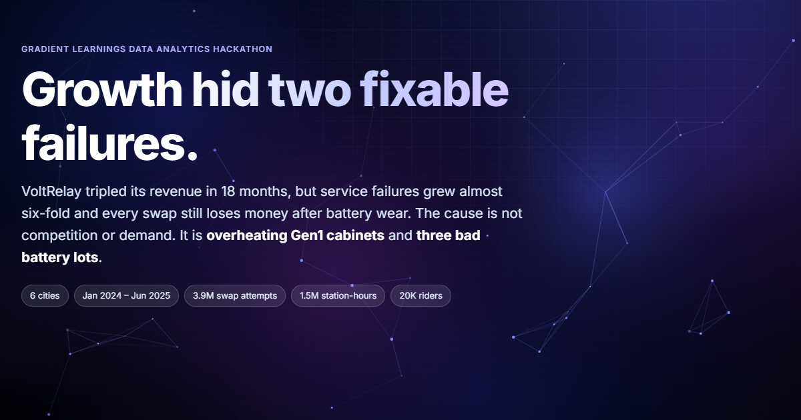

<p align="center">
  <a href="https://andringodson.github.io/Hackathon-DataAnalytics26/"></a>
</p>

<h1 align="center">VoltRelay Energy: Battery-Swap Network Analysis</h1>


<p align="center">
  <a href="https://andringodson.github.io/Hackathon-DataAnalytics26/"></a>
  <a href="https://colab.research.google.com/github/andringodson/Hackathon-DataAnalytics26/blob/main/notebooks/VoltRelay_Analysis.ipynb"></a>
  <a href="report/analysis_report.pdf"></a>
</p>

<p align="center">
  <a href="https://andringodson.github.io/Hackathon-DataAnalytics26/"></a>
</p>

VoltRelay runs a battery-swapping network for electric two- and three-wheelers in six Indian cities. Between January 2024 and June 2025 its revenue tripled, but service failures grew almost six-fold and every swap still lost money after battery wear. This project finds out why, using 3.9M swap attempts, 1.5M hours of station telemetry, the battery ledger, rider records and support tickets.

## Deliverables

| Deliverable | What it contains | Link |
|---|---|---|
| **Colab notebook** | Data understanding, cleaning, EDA, all six core questions and five deep dives. Runs top to bottom. | [Open in Colab](https://colab.research.google.com/github/andringodson/Hackathon-DataAnalytics26/blob/main/notebooks/VoltRelay_Analysis.ipynb) · [`.ipynb`](notebooks/VoltRelay_Analysis.ipynb) |
| **Analysis report** | Problem, approach, insights, visuals, findings and recommendations. | [Markdown](report/analysis_report.md) · [PDF](report/analysis_report.pdf) |
| **Three-minute video** | Narrated walkthrough of the live dashboard, following the script, with captions, score and sound design. 4K, 2:58. | [Watch / download](https://github.com/andringodson/Hackathon-DataAnalytics26/releases/download/video-v1/VoltRelay_3min_video.mp4) · [script](report/video_script.md) · [how it's made](video/README.md) |
| **Interactive dashboard** (bonus) | The whole analysis as an explorable web app. See [below](#the-interactive-dashboard). | [andringodson.github.io/Hackathon-DataAnalytics26](https://andringodson.github.io/Hackathon-DataAnalytics26/) |

## Key findings

1. **Growth masked a quality problem.** Completed swaps grew 2.8× and revenue 3.0×, but service failures grew 5.7×, and contribution per swap after battery wear did not improve.
2. **Failures are Gen1 cabinets in the heat.** Above 40 °C, Gen1 charge time doubles (88 → 174 min) and cabinets are empty in 58% of hours. Gen2/3 are unaffected. Delhi NCR, Jaipur and Hyderabad hold 36 of the 51 Gen1 cabinets, so failures triple there every summer.
3. **Three bad battery lots eroded margin.** Kyron lots KY-2407/08/09 degrade ~3× faster than every other lot. They wiped out the July 2024 price rise in wear cost (~₹45M in excess wear) and cut delivered range.
4. **New riders churn when the network fails them early.** Early stockouts and short range are the primary drivers. City, 3W and plan type are secondary. Competitors are not a driver.
5. **The fixes missed the target.** Expansion went to easy sites rather than failing ones, the pricing pilot ran where there was no congestion, and the largest partner (ZipDrop) is the least profitable 2W partner after its 28% discount.

**Top recommendations:** upgrade or cool the 36 hot-city Gen1 cabinets before summer 2026 · replace the bad Kyron lots and claim warranty · renegotiate ZipDrop rather than signing an exclusive · protect new riders' first 14 days · use peak pricing only where congestion is real.

## The interactive dashboard

**[andringodson.github.io/Hackathon-DataAnalytics26](https://andringodson.github.io/Hackathon-DataAnalytics26/)** tells the story in eight sections: overview, failures, stations, batteries, pricing, retention, recommended actions and data quality. It opens with four headline numbers and three key findings.

**Explore the data**
- **Charts:** 19 interactive charts with hover details. Each one has a *Table* view and a *CSV* download.
- **Filters:** a city filter drives the failure heatmap, the station map and the worst-stations table together. A pack-type toggle and a retention-factor picker drive their charts. Charts animate from old values to new ones instead of redrawing.
- **Station map:** built on MapLibre GL with free OpenFreeMap vector tiles, with no API key and no watermark beyond the required OpenStreetMap credit. It has three views: stations, heatmap and 3D columns. Hover any station for its numbers, click one in the worst-10 table to fly to it, and export the view as PNG or the station list as CSV.

**Design**
- **Theme:** OLED-black by default, with a cursor-reactive royal background of slow sapphire and amethyst glows and a gold-flecked constellation. A light theme is one click away, and the choice is remembered.
- **Type and detail:** serif headlines with gold italic accents, gold section numerals and hairline rules. Cards glow and lift under the cursor.
- **Transitions:** the hero enters in sequence and cards cascade in as you scroll. Figures count up and meters fill. A pill slides along the section nav and a thumb glides between toggle options. Switching theme reveals the new one in a circle from the toggle.
- **Layout:** fully responsive from 320 px phones to wide desktops. Some charts switch to a dedicated phone layout.

**Accessibility and speed**
- **Accessibility:** zero [axe-core](https://github.com/dequelabs/axe-core) violations in both themes. It works fully by keyboard, including arrow keys in toggles and visible focus rings. It respects *reduced motion*. Every chart has a table alternative, and the colour palette is checked for colour-blind readers.
- **First visit:** content appears in about 1.2 s. The map library downloads only when you reach the map, charts are built one per frame ahead of view, and the background pauses in hidden tabs.
- **Repeat visits:** about 0.3 s. A service worker keeps a local copy of the site, and updates still arrive immediately. It is installable to a phone home screen and has a preview image for shared links.

A Streamlit version ([`dashboard/app.py`](dashboard/app.py)) is included for running the same views locally in Python.

## Repository layout

```
notebooks/
  VoltRelay_Analysis.ipynb   executed Colab notebook (the main deliverable)
  src/*.py                   notebook source in percent-format cells (readable diffs)
  build_notebook.py          assembles src/*.py into the .ipynb
report/
  analysis_report.md / .pdf  written report
  video_script.md            three-minute presentation script
  figures/                   all charts, exported by the notebook
site/
  index.html                 the hosted dashboard (plain HTML/CSS/JS, no framework or bundler)
  styles.css, app.js         design, transitions, charts and map
  build.py                   packs data/processed into data.json and versions the assets
  sw.js, manifest.webmanifest   offline cache and install metadata
  logo.svg, icon-*.png       logo and app icons
  og.png                     link-preview image
video/                       scripts that record and narrate the three-minute video from the live dashboard
dashboard/app.py             Streamlit version of the dashboard
data/
  download_data.py           fetches the eight raw CSVs (~830 MB) from the organiser's Drive
  processed/                 small aggregated tables exported by the notebook (dashboard input)
.github/workflows/pages.yml  builds and deploys the dashboard to GitHub Pages on every push
```

The raw data is never committed: `swap_events.csv` alone is 729 MB, above GitHub's 100 MB file limit.

## Reproducing

**In Colab:** click the badge above and choose *Runtime → Run all*. The first cell downloads the data (~2 min) and a full run takes about 10 minutes.

**Locally:**

```bash
pip install -r requirements.txt gdown seaborn statsmodels scikit-learn scipy matplotlib nbformat nbconvert ipykernel
python data/download_data.py                        # -> data/raw/
cd notebooks && VOLTRELAY_DATA=../data/raw VOLTRELAY_FIGS=../report/figures VOLTRELAY_OUT=../data/processed \
  jupyter nbconvert --to notebook --execute VoltRelay_Analysis.ipynb --inplace
cd ..
python site/build.py && python -m http.server -d _site   # web dashboard at localhost:8000
streamlit run dashboard/app.py                            # Streamlit version
```

## Data-quality handling at a glance

Every documented issue was tested before it was handled, and three undocumented ones were found:

- **Firmware v3.2.0 clock bug:** 139,490 events shifted +5 h 30 m. Proven by PEAK tariffs appearing at off-tariff hours.
- **Test stations:** excluded. They carry 62K events and ₹3.9M revenue, not "a few zero-value rows", so this is flagged.
- **Offline-sync duplicates:** tested, none present in this export.
- **City spellings:** 21 variants of 6 cities standardised. **Outliers:** odometer and sensor readings nulled or clipped.
- **Telemetry gaps:** never zero-filled. **CSAT:** missing not at random, so it is not used as a KPI.
- **Undocumented:** `payment_mode` is constant; PREPAID/PROMO tariffs never occur; battery IDs are physically inconsistent (analysed as cohorts); packs marked retired are still being issued.

## Built with

- **Analysis:** Python, pandas, statsmodels (weighted and logistic regression, difference-in-differences), scikit-learn (gradient-boosting check), matplotlib and seaborn.
- **Dashboard:** plain HTML, CSS and JavaScript; [Apache ECharts](https://echarts.apache.org/) for charts; [MapLibre GL](https://maplibre.org/) with [OpenFreeMap](https://openfreemap.org/) tiles for the map; hosted on GitHub Pages via GitHub Actions.
- **Local app:** Streamlit and Plotly.
