# VoltRelay Energy: What Is Really Driving Service Quality, Retention and Margin

**Analysis report · Gradient Learnings Data Analytics Hackathon**

Data: 3.88M swap attempts, 1.49M station-hours, 20K riders, 6.5K batteries, 44K tickets · 6 cities · Jan 2024 – Jun 2025

Full reproducible analysis: [VoltRelay_Analysis.ipynb](https://github.com/andringodson/Hackathon-DataAnalytics/blob/main/notebooks/VoltRelay_Analysis.ipynb) · Interactive dashboard: [voltrelay-analytics.streamlit.app](https://voltrelay-analytics.streamlit.app)

---

## Executive summary

VoltRelay grew fast — completed swaps **2.8×**, revenue **3.0×** — but monthly service failures grew **5.7×** and contribution per swap after battery wear did not improve. Two operational causes explain most of what went wrong, and both are fixable:

1. **Gen1 charging cabinets fail in the heat.** Above 40 °C a Gen1 cabinet's charge time doubles (88 → 174 min) and it has zero charged 2W packs in **58% of hours**. Gen2/Gen3 cabinets are unaffected. Delhi NCR, Jaipur and Hyderabad hold 36 of the 51 Gen1 cabinets and the hottest summers, so network failure rates triple every April–June, concentrated at those sites.
2. **Three bad battery lots are eroding margin and range.** Kyron lots KY-2407/08/09 (1,461 packs, ~22% of swaps since Oct 2024) lose SoH **~3× faster** than every other lot. They added ~₹16 of wear cost per swap within two months, wiping out the July 2024 price rise, and they cost ~₹45M in excess wear over the period.

**New riders churn when the network fails them early.** Early stockouts and short delivered range are the primary churn drivers. City, vehicle class and plan type are secondary. Competitors are not a driver.

**Recommended priorities:** upgrade or cool the 36 hot-city Gen1 cabinets before summer 2026; replace the bad Kyron lots and pursue a warranty claim; renegotiate (don't lock in) the ZipDrop contract; protect new riders' first 14 days; use peak pricing only where congestion is real.

---

## 1. Problem understanding

VoltRelay runs unmanned battery-swap cabinets for gig and logistics riders who cannot afford downtime. Over 18 months it expanded in two waves (30 + 30 stations), raised base prices, piloted peak/off-peak pricing, added a new battery supplier (Kyron) and renegotiated its largest fleet contract. Leadership sees three symptoms: **service failures rising faster than volume, falling new-rider retention and eroding per-swap profitability.** It wants to know what drives them before committing the next operating budget, with four competing proposals on the table (more stations, more batteries, network-wide pricing, a long-term exclusive with the largest partner).

The task is diagnostic, not predictive: find the evidence-backed drivers, separate primary from secondary, and translate them into priorities.

## 2. Analytical approach

**Data preparation.** Every documented data-quality issue was *tested* before being handled. Three undocumented issues were also found:

| Issue | Finding | Treatment |
|---|---|---|
| Firmware v3.2.0 clock bug | 139,490 events logged 5 h 30 m early. Proven by PEAK tariffs appearing at off-tariff hours | Corrected (+5:30) |
| Test stations STN-TST-01/02 | Not "a few zero-value rows": **62K events, ₹3.9M revenue** | Excluded, flagged as anomaly |
| Offline-sync near-duplicates | **None present**. Close same-rider pairs always use different packs; `offline_batch` share equals baseline | Check kept, nothing removed |
| Odometer / sensor outliers | 15.3K invalid km readings; ~13K SoC/SoH readings >100% | Nulled / clipped |
| City spellings | 21 variants of 6 cities | Standardised |
| Missing telemetry, CSAT | Telemetry gaps at poor-connectivity sites; CSAT exists only for resolved tickets (not at random) | Never zero-filled; CSAT not used as a KPI |
| *Undocumented* | `payment_mode` is constant; PREPAID/PROMO tariffs never occur; battery IDs appear at two stations minutes apart | Batteries analysed as cohorts, not traced |

**Unit economics.** Contribution per completed swap = revenue − energy (kWh × local tariff) − station fixed cost (rent + maintenance ÷ monthly swaps) − battery wear (pack cost × share of useful life consumed per swap, from observed SoH loss). Battery wear carries the most assumptions, so every margin result is shown **before (CM1) and after (CM2) wear**. The conclusions hold under both.

**Methods.** KPI trends; segmentation by station, city, hour, season, vehicle class, equipment and partner; hourly telemetry joined to weather; a station-day regression with a generation × heat interaction; battery lot cohorts; a **difference-in-differences** evaluation of the pricing pilot with station and date fixed effects; **cohort retention curves**; and a logistic regression cross-checked with a gradient-boosting model (hold-out AUC 0.69) to rank churn drivers. Ticket free text was keyword-classified (English and Hinglish).

## 3. Key insights

### Insight 1 — Growth hid a quality problem, and the metrics disagree

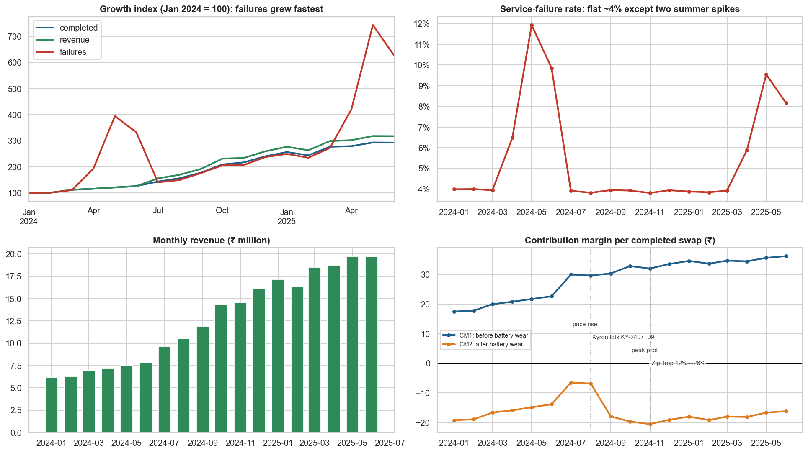

Revenue and swaps grew steadily. The failure rate did not creep up: it sits at ~4% and **spikes every summer** (11.9% in May 2024, 9.5% in May 2025). Because growth puts ever more swaps into those months, absolute failures grew 5.7×. Contribution before wear improved (₹18 → ₹35 per swap) as stations filled up. After wear it barely moved (−₹18 → −₹17), because battery wear jumped just as the price rise landed.

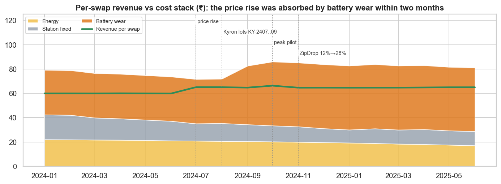

### Insight 2 — Failures are concentrated: Gen1 cabinets in three hot cities, in summer

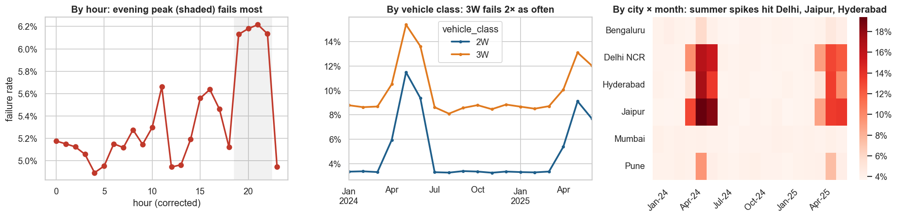

All 25 worst stations are Gen1 launch-era sites in Delhi NCR, Jaipur and Hyderabad. The worst 20% of stations carry 43% of failures. 3W riders fail twice as often as 2W riders all year round. Queue wait is flat (~4 min) everywhere: the experience fails through **empty cabinets**, not long queues.

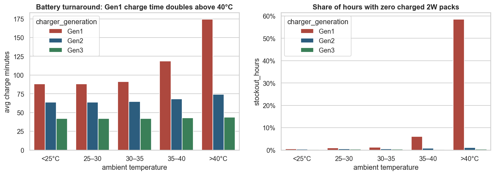

Hourly telemetry shows the mechanism. Gen1 charge time doubles above 40 °C and the cabinet runs dry in 58% of those hours, while Gen2 and Gen3 barely change. A station-day regression controlling for city, site type, host and connectivity confirms it: a >38 °C day adds ~5 pp of failure at Gen2 and **a further ~9 pp at Gen1**. Location type, host and connectivity have no material effect. Gen1 cabinets account for ~35K excess failures (17% of all failures), 94% of them in the three hot cities.

### Insight 3 — Three bad battery lots drove margin erosion and falling range

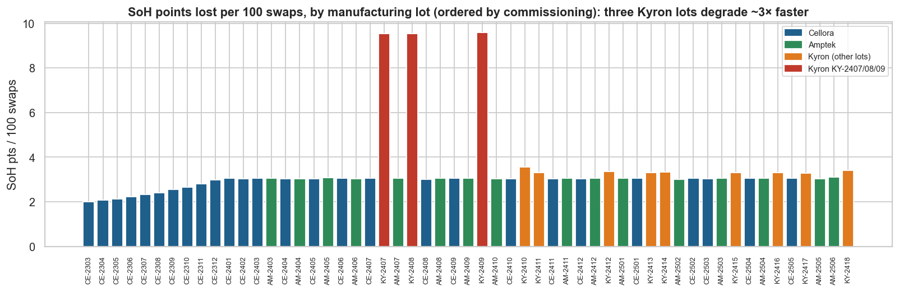

Kyron's first deliveries (lots KY-2407/08/09, Jul–Sep 2024) degrade at ~9.6 SoH points per 100 swaps vs ~3 for every other lot, including Kyron's later lots, which points to a batch defect. The 2W packs reached ~61% SoH within a year. They explain the September 2024 step-up in wear cost (₹36 → ₹53 per swap) and ~₹45M of excess wear.

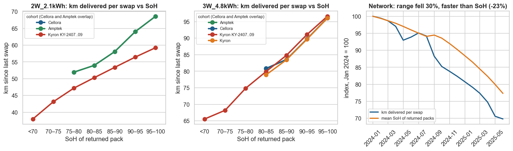

SoH drives range almost linearly: a 2W pack at 95–100% SoH delivers ~67 km, below 70% only ~38 km. Network range per swap fell from 74 km to 51 km. Riders on degraded packs swap ~20% more often, which **adds load to stations that are already stocking out**.

### Insight 4 — Pricing helped revenue, not reliability; the largest partner is the least valuable

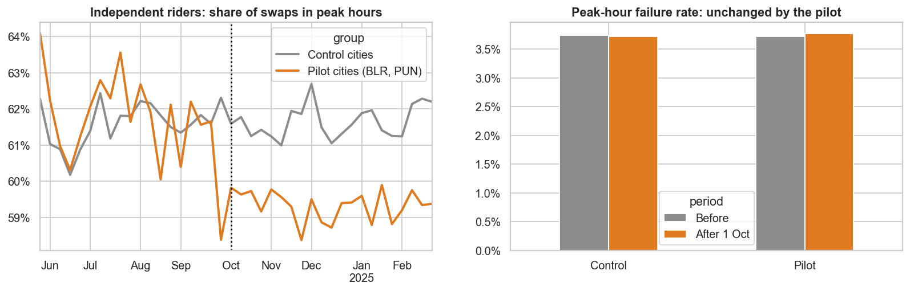

- **Base price rise (Jul 2024):** +₹5 per 2W swap with no detectable drop in usage or retention.
- **Peak/off-peak pilot (Bengaluru & Pune, from Oct 2024):** the DiD shows riders who pay the surcharge moved 2.5–3.5 pp of swaps out of peak hours, and revenue rose ₹6–8 per exposed swap. **Peak-hour reliability did not change**, because the pilot ran in the two *least* congested cities. Surcharge-exempt partners did not respond at all.

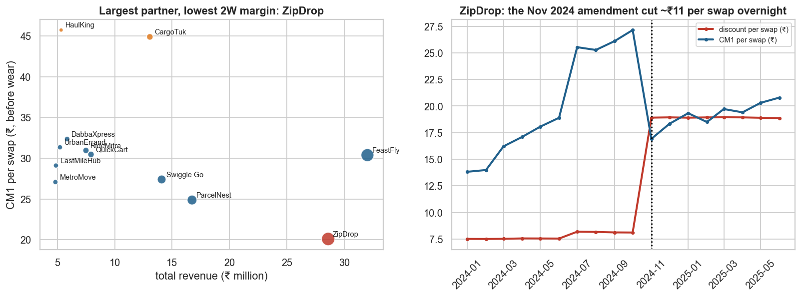

**ZipDrop is the largest partner by volume but the least profitable 2W partner.** Its November 2024 amendment (discount 12% → 28%) cut ~₹11 of revenue per swap overnight. It is also exempt from the peak surcharge while doing ~73% of its swaps at peak, and it has 45-day payment terms. FeastFly generates more total contribution on fewer swaps. The amendment costs ~₹5.5M a year.

### Insight 5 — New riders leave when the network fails them early

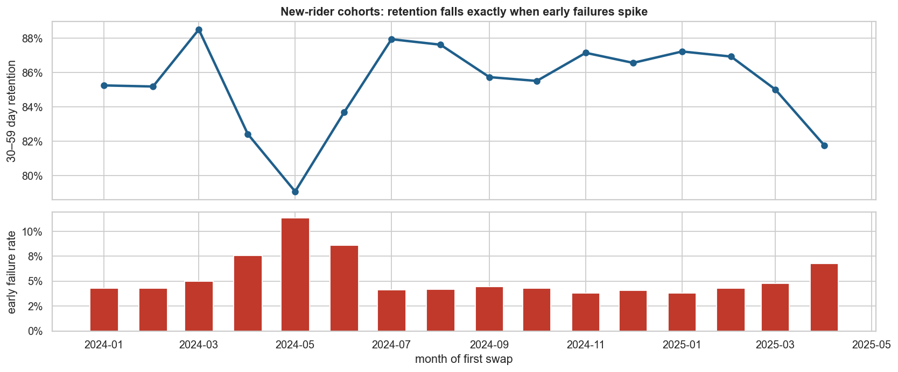

Monthly new-rider cohorts' 30–59-day retention moves almost perfectly against their early failure rate (correlation −0.87). The May 2024 cohort, which met 11% failures in its first two weeks, retained at 79% vs ~87% in normal months.

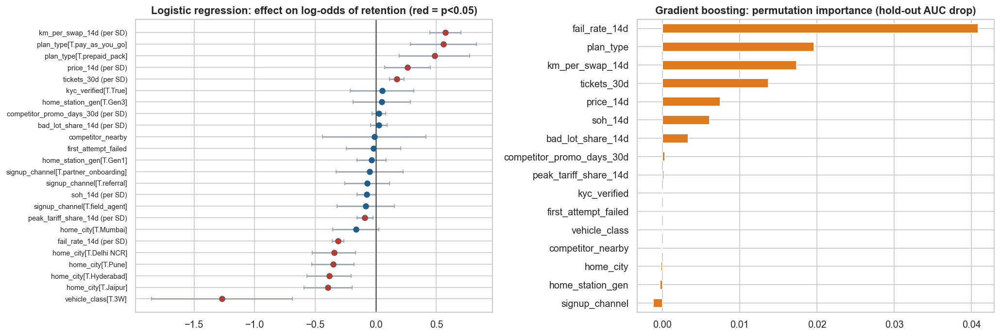

| Tier | Driver | Evidence |
|---|---|---|
| **Primary** | Early service failure (first 14 days) | Retention ~87% at 0% early failure → ~65% above 20%; strongest behavioural effect in both models |
| **Primary** | Delivered range per swap (first 14 days) | Second-strongest effect. Battery lot and SoH only matter *through* range |
| Secondary | 3W vehicle, hot/Gen1-heavy home city, partner-billed plan | Significant, smaller effects |
| Minor | Peak-tariff exposure | Small negative effect (p < 0.01) |
| Not drivers | Competitor nearby, competitor promotions, signup channel, KYC | Not significant |

### Insight 6 — The fixes so far missed the target

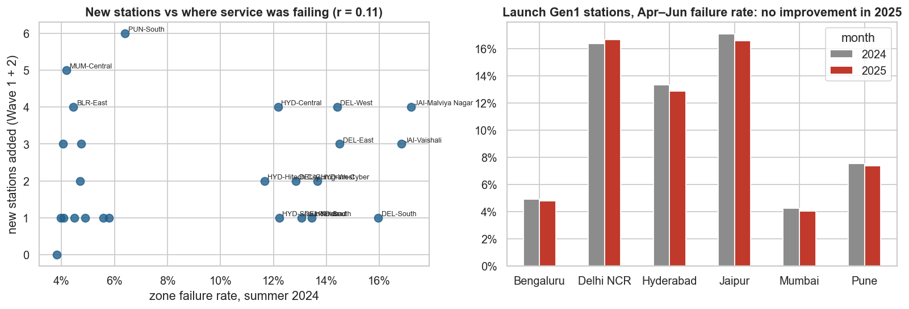

New stations were placed with essentially no regard to where service was failing (r = 0.11). Wave 1 went mostly to highway fuel pumps and residential sites (~55 swaps/day vs ~77 at launch hubs). The Gen1 hubs behind the failures were not upgraded: their Apr–Jun failure rate in 2025 is unchanged from 2024.

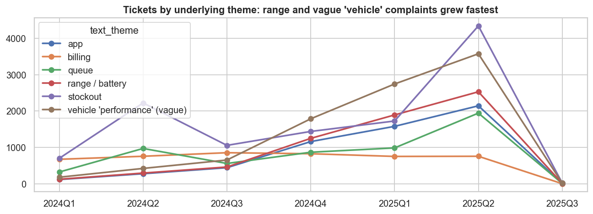

Ticket text confirms the battery story. All 9,385 tickets filed as "other" are vague vehicle complaints ("scooter weak lag raha hai"), and they reference bad-lot packs at the same elevated rate as explicit range complaints. Counted together, range-type complaints have been the **largest complaint theme since Q4 2024**.

## 4. Business findings

1. **Service failure is concentrated, seasonal and predictable**, not a network-wide capacity shortfall. It is an equipment problem (Gen1 × heat) in three cities.
2. **Margin erosion is a battery-quality problem**, compounded by partner terms. Energy and site costs per swap actually fell.
3. **Churn follows the operational failures.** Fixing stockouts and battery range addresses retention directly. Competitive pressure is not the cause.
4. **Recent decisions optimised for ease, not impact.** Expansion went to easy sites, the pricing pilot ran where there was no congestion, and the largest contract was renegotiated in the partner's favour.
5. **Operational data needs attention.** Test stations are booking real revenue, packs marked retired are still being issued (~22% of swaps after 15 Jun 2025, a possible safety issue), cabinet clocks drift and pack IDs are unreliable.

## 5. Recommendations

### Evaluating the four budget proposals

| Proposal | Verdict | Instead |
|---|---|---|
| More stations | ✗ as proposed | Upgrade or cool Gen1 cabinets in Delhi NCR, Jaipur and Hyderabad first. Site new stations by unmet demand. |
| More batteries | ◐ replace, don't expand | Replace the bad Kyron lots (warranty claim); retire packs below ~75% SoH sooner |
| Network-wide pricing | ◐ targeted only | Peak pricing at congested hot-city hubs in summer; 30-day grace period for new riders; close surcharge exemptions |
| Exclusive with largest partner | ✗ | Renegotiate ZipDrop: discount floor, surcharge billing, 30-day terms. Grow higher-margin partners. |

### Prioritised action plan

| Priority | Action | Expected impact |
|---|---|---|
| **1** | Upgrade or retrofit cooling on the 36 hot-city Gen1 cabinets before April 2026; pre-position charged stock at these sites in Apr–Jun | Removes most of the ~35K excess failures; protects summer new-rider cohorts |
| **2** | Replace KY-2407/08/09 packs, claim warranty, add an SoH retirement threshold, fix the asset ledger | ~₹12 less wear per swap network-wide; restores range; cuts range complaints |
| **3** | Renegotiate ZipDrop; no exclusivity | ~₹5.5M a year of margin recovered |
| **4** | Protect new riders' first 14 days: route to reliable stations and healthy packs; follow up after a failed first attempt | Directly targets the primary churn drivers |
| **5** | Targeted peak pricing, not a network-wide rollout | Keeps the ₹6–8/swap revenue gain where it also relieves congestion |
| **6** | Data hygiene: cabinet clock sync, pack-ID capture, test-station revenue reconciliation, text-based ticket re-classification | Trustworthy KPIs for the next budget cycle |

*Limitations.* This is observational data, so the findings are associations. They are backed by mechanisms that agree across independent tables (telemetry, events, battery ledger, tickets). Battery wear depends on an assumed 70% SoH end-of-life, which is why margin is reported before and after wear. Retention is measured as activity in days 30–59 after the first swap.
